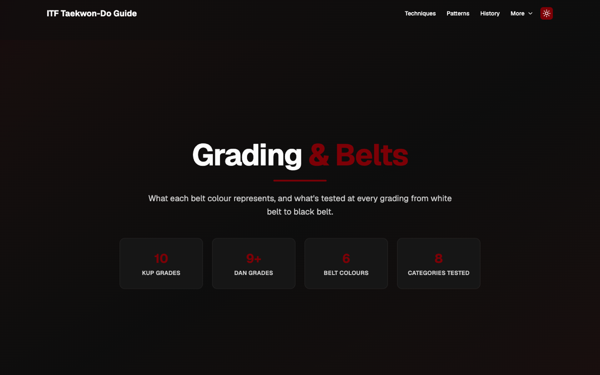
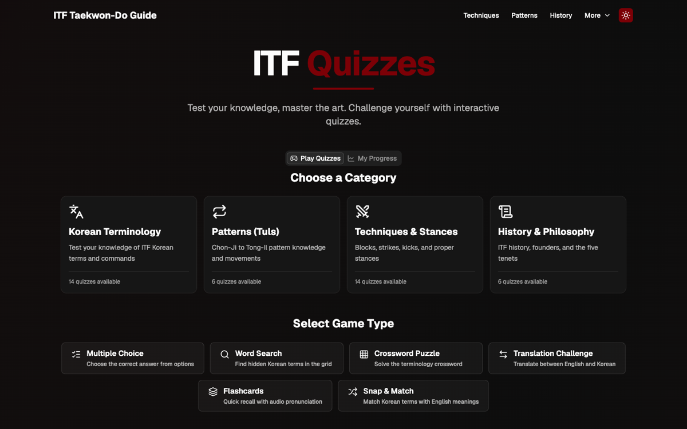
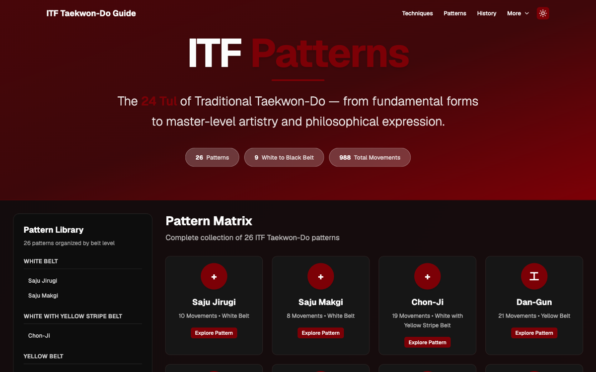

<div align="center">

# ITF Taekwon-Do Guide

A study companion for ITF Taekwon-Do students preparing for grading — patterns, techniques,
terminology, history, and belt requirements in one place, with interactive quizzes to test
retention.


[Features](#features) · [Tech stack](#tech-stack) · [Getting started](#getting-started) · [Pages](#pages) · [Content sourcing](#content-sourcing) · [License](#license)

</div>

## Overview

ITF Taekwon-Do Guide is a reference and revision app for students of the International
Taekwon-Do Federation (ITF) system — the style founded by General Choi Hong Hi in 1955. It
brings together the 26 patterns (Tul), 78 techniques across six categories, 90 terminology
terms, the belt grading structure, and 40 quizzes across six game types, so a student can look
something up or drill themselves on it without digging through a syllabus PDF.


## Features

**Patterns (Tul)** — all 26 patterns from Chon-Ji through Tong-Il, plus the two foundational
Saju drills, with belt level, movement count, and a linked video demonstration for each.

**Techniques** — 78 techniques across stances, blocks, strikes, thrusts, punches, and kicks,
grouped by the belt level they're introduced at, with Korean names and descriptions.

**Terminology** — 90 Korean terms across 18 categories, with audio pronunciation and a
searchable, filterable table.

**History** — a chronological timeline of the ITF's founding, key figures, and its evolution
since the 2002 organisational split.

**Grading & Belts** — what each belt colour represents, a grade-by-grade breakdown from 10th
kup to 1st dan and above, and what's actually tested at a grading.



**Quiz hub** — 40 quizzes across 6 game types (multiple choice, word search, translation,
crossword, flashcards, and matching), filterable by category, game type, and difficulty, with
a progress dashboard and unlockable achievements tracked locally in the browser.



**Patterns matrix** — a filterable library view of all patterns organised by belt level.



Every page supports light and dark themes, and is responsive from mobile to desktop.

## Tech stack

| Layer              | Technology                                  |
| ------------------- | -------------------------------------------- |
| Framework           | React 19 + Vite 7                            |
| Routing             | React Router 7                               |
| Styling             | Tailwind CSS 4                               |
| Component library   | shadcn/ui on Radix UI primitives             |
| Icons               | lucide-react                                 |
| State               | Zustand (with `persist` for saved progress)  |
| Fonts               | Geist Variable                               |

## Getting started

### Prerequisites

- Node.js 20.19+ (or 22.12+)
- npm

### Setup

```bash
git clone https://github.com/ryjord/ITF-Taekwon-Do-Guide.git
cd ITF-Taekwon-Do-Guide
npm install
npm run dev
```

Other scripts:

```bash
npm run build     # production build
npm run preview   # preview the production build locally
npm run lint       # run eslint
```

## Pages

| Route          | Description                                                       |
| --------------- | -------------------------------------------------------------------- |
| `/`             | Home — hero, feature highlights, and philosophy                     |
| `/techniques`   | Technique library by category and belt level                        |
| `/patterns`     | Pattern matrix and individual pattern detail pages                   |
| `/terminology`  | Searchable Korean terminology table with audio                       |
| `/history`      | ITF history timeline                                                 |
| `/grading`      | Belt meanings, grade-by-grade progression, and grading structure     |
| `/quiz`         | Quiz hub, all six game types, and the progress dashboard             |

## Content sourcing

Pattern, technique, and terminology data is compiled from publicly available ITF-affiliated
resources. The grading criteria and belt-colour meanings on the `/grading` page are sourced
from General Choi Hong Hi's writings and independent ITF-affiliated publications, with sources
linked directly on the page — individual ITF schools set their own exact syllabus and
requirements, so this content is general guidance, not an official syllabus. It should not be
treated as a substitute for instruction from a qualified ITF instructor.

Pattern video links point to third-party YouTube demonstrations and are provided for reference;
they are not officially affiliated with or endorsed by the video creators.

## License

All rights reserved — see [LICENSE](LICENSE). The source is available to view for educational
reference; it isn't licensed for reuse, modification, or redistribution.
